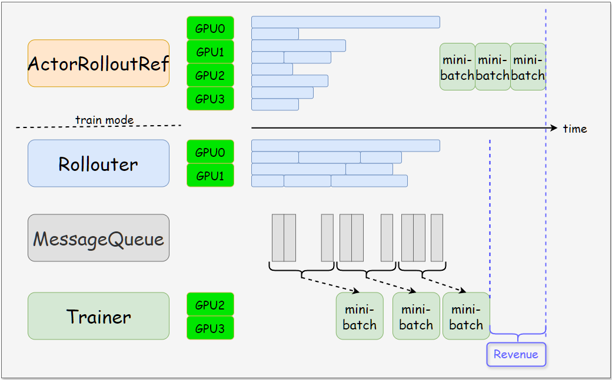
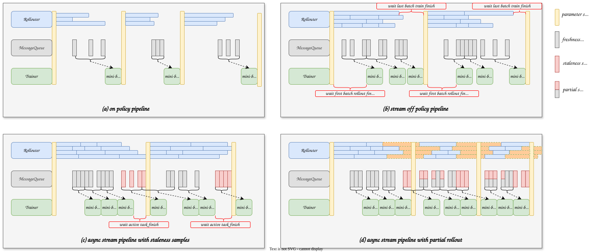
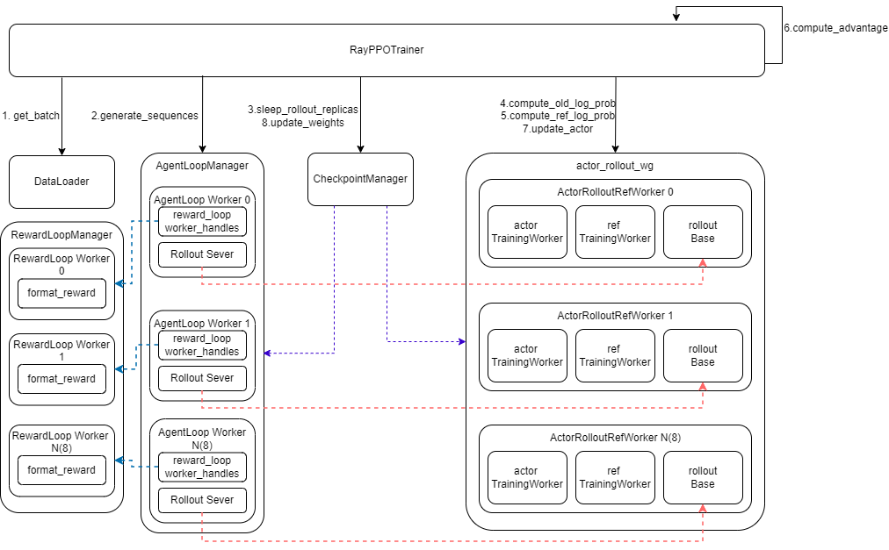
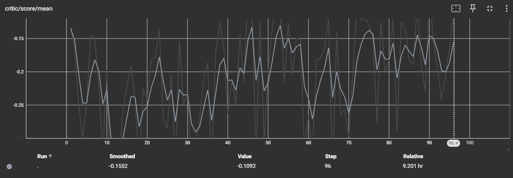

# verl 代码学习笔记
### 数据划分配置
按 `examples/alpamayo_demo/run_qwen3_vl_alpamayo_demo.sh` 里的关键配置：

```text
data.train_batch_size = 2
actor_rollout_ref.rollout.n = 2
actor_rollout_ref.actor.ppo_mini_batch_size = 2
actor_rollout_ref.actor.ppo_micro_batch_size_per_gpu = 1
trainer.n_gpus_per_node = 4   
```

按 demo 配置、数据集 8 条、4 GPU 时，流程是：

1. **DataLoader 取原始样本**
   - `data.train_batch_size=2` 表示每个训练 step 从训练集取 2 条原始数据。
   - 8 条数据、`drop_last=True`，每 epoch 有 `8 / 2 = 4` 个训练 step。
   - demo 没设置 `data.shuffle`，默认是 `True`，所以顺序会被随机采样。

2. **每条样本生成多个 rollout**
   - `rollout.n=2` 表示每条 prompt 生成 2 个 response。
   - 所以一个 step 中：
     - 原始 prompt：2 条
     - rollout 后序列：`2 * 2 = 4` 条
   - 形态类似：
     ```text
     sample0 -> response0, response1
     sample1 -> response0, response1
     ```

3. **rollout 分到 GPU**
   - 4 条 rollout 序列切给 4 GPU。
   - 每张 GPU 处理 1 条生成序列。

4. **reward / advantage**
   - reward 对 4 条 response 分别打分。
   - GRPO 会按原始 prompt 分组：每组 2 条 response。
   - 也就是 sample0 的 2 个 response 互相比较，sample1 的 2 个 response 互相比较，然后算 advantage。

5. **actor PPO update**
   - `ppo_mini_batch_size=2` 是按“原始 prompt 数”理解；代码里会乘 `rollout.n`。
   - 所以 PPO 全局 mini-batch 实际是：
     ```text
     2 * 2 = 4 条 rollout 序列
     ```
   - 当前 step 正好也是 4 条 rollout 序列，所以只有 1 个 PPO mini-batch。
   - 4 GPU 下，每 GPU 拿 1 条序列。

6. **micro batch**
   - `ppo_micro_batch_size_per_gpu=1` 表示每张 GPU 上一次 forward/backward 处理 1 条序列。
   - 因为每 GPU mini-batch 也是 1，所以没有额外梯度累积。
   - 如果每 GPU mini-batch 是 2，micro=1，就会拆成 2 次 micro forward/backward，再做一次 optimizer step。

如果要用 **8 GPU + 8 条数据**，建议至少改成下面这种之一：

```text
data.train_batch_size=4
actor_rollout_ref.actor.ppo_mini_batch_size=4
actor_rollout_ref.rollout.n=2
actor_rollout_ref.actor.ppo_micro_batch_size_per_gpu=1
trainer.n_gpus_per_node=8
```

这时每 step：

```text
4 条原始样本
-> 每条生成 2 个 response
-> 8 条 rollout 序列
-> 8 GPU 每张 1 条
-> 1 个 PPO mini-batch
-> 每 GPU micro batch = 1
```

8 条数据一共跑 2 个 training step。

如果想一整个 epoch 只跑 1 step，可以用：

```text
data.train_batch_size=8
actor_rollout_ref.actor.ppo_mini_batch_size=8
```

这时：

```text
8 条原始样本
-> 16 条 rollout 序列
-> 8 GPU 每张 2 条
-> 每 GPU 按 micro=1 拆成 2 次 backward 累积
-> 1 次 optimizer step
```

核心记法是：

```text
每步原始样本数 = data.train_batch_size
每步训练序列数 = data.train_batch_size * rollout.n
PPO 全局 mini-batch 序列数 = ppo_mini_batch_size * rollout.n
每 GPU micro batch = ppo_micro_batch_size_per_gpu
```

对 8 GPU，至少要保证：

```text
data.train_batch_size * rollout.n >= 8
ppo_mini_batch_size * rollout.n >= 8
```

并且通常要能被 8 整除。

---

**actor 的 optimizer step 是按 PPO mini-batch 触发的**，不是按 micro-batch，也不是等整个 epoch。

在当前 `verl.trainer.ppo.ray_trainer` 流程里，一个训练 step 大致是：

```text
取 data.train_batch_size 条 prompt
-> rollout 生成 responses
-> reward
-> old_log_probs
-> ref_log_prob
-> advantage
-> update_actor
-> sync actor weights to rollout
-> 下一个训练 step
```

进入 `update_actor` 后，actor 内部再这样切：

```text
整个训练 batch
-> 按 ppo_mini_batch_size 切成 PPO mini-batches
-> 每个 mini-batch 再按 ppo_micro_batch_size_per_gpu 切成 micro-batches
-> micro-batch 只做 forward/backward 累积梯度
-> 一个 PPO mini-batch 的所有 micro-batch 跑完后，调用一次 optimizer.step()
```

所以关系是：

```text
micro-batch：显存切分单位，只累积梯度
PPO mini-batch：一次 actor 参数更新单位
train batch：一次 rollout + reward + advantage 的数据来源
```

按你 demo 配置：

```text
data.train_batch_size = 2
rollout.n = 2
ppo_mini_batch_size = 2
ppo_micro_batch_size_per_gpu = 1
ppo_epochs = 1  # 默认
```

每个训练 step：

```text
2 条原始样本
-> 4 条 rollout 序列
-> PPO mini-batch 也是 2 条原始样本 * 2 rollout = 4 条序列
-> 只有 1 个 PPO mini-batch
-> actor optimizer.step() 1 次
-> 然后同步给 rollout
```

如果你改成比如：

```text
data.train_batch_size = 8
rollout.n = 2
ppo_mini_batch_size = 4
ppo_micro_batch_size_per_gpu = 1
```

那每个训练 step 是：

```text
8 条原始样本
-> 16 条 rollout 序列
-> 每个 PPO mini-batch = 4 * 2 = 8 条 rollout 序列
-> 一共 2 个 PPO mini-batch
-> actor optimizer.step() 2 次
-> 这 2 次都完成后，才同步给 rollout
```

**rollout 权重同步时机**：不是每个 PPO mini-batch 后同步，而是 `_update_actor(batch)` 整个返回之后同步一次。也就是说，一个 train batch 内如果有多个 PPO mini-batch，actor 会连续更新多次，但 rollout 仍然用旧权重，直到这个训练 step 的 actor update 全部结束，才执行：

```text
checkpoint_manager.update_weights(global_steps)
```

另外训练刚开始也会先同步一次，用来确保 rollout 侧拿到初始 actor 权重。demo 里 `critic_warmup=0`，所以正常每个训练 step 都是：

```text
rollout 用当前已同步权重生成
-> actor 用这批 rollout 更新
-> 更新完成后同步新 actor 权重给 rollout
-> 下一 step 的 rollout 使用新权重
```

---

`ppo_epochs` 表示：**同一批 rollout 数据被 actor 重复训练多少轮**。

在 verl 里，一次训练 step 会先生成一批数据：

```text
data.train_batch_size 条 prompt
-> 每条生成 rollout.n 个 response
-> 算 reward / advantage / old_log_probs
```

然后进入 actor update。`ppo_epochs` 控制这批已经生成好的数据会被重复用于 PPO 更新几遍：

```text
for epoch in range(ppo_epochs):
    for mini_batch in PPO mini-batches:
        forward/backward
        optimizer.step()
```

所以：

```text
actor optimizer step 次数
= ppo_epochs * (train_batch_size / ppo_mini_batch_size)
```

这里的 `train_batch_size` 和 `ppo_mini_batch_size` 都按“原始 prompt 数”理解；代码里会一起乘 `rollout.n`，比例不变。

你的 demo 默认没有显式设置，所以用配置默认值：

```text
actor_rollout_ref.actor.ppo_epochs = 1
```

也就是每批 rollout 数据只训练一遍。

举例：

```text
data.train_batch_size = 8
rollout.n = 2
ppo_mini_batch_size = 4
ppo_epochs = 3
```

流程是：

```text
一次生成 8 * 2 = 16 条 rollout 序列
每个 PPO mini-batch = 4 * 2 = 8 条序列
每轮有 2 个 mini-batch
ppo_epochs=3，所以同一批 16 条序列会被重复训练 3 轮
actor optimizer.step() = 3 * 2 = 6 次
```

注意：`ppo_epochs` 不会重新 rollout。它只是复用同一批旧 response、reward、advantage 多训练几遍；全部 PPO epoch 完成后，才把 actor 新权重同步给 rollout，用于下一批生成。

### verl 中的 worker 设计
[verl.single_controller 的设计](https://verl.org.cn/en/latest/single_controller.html)
single_controller 的目标，是让你写分布式 RLHF / PPO 时，代码看起来尽量像单进程脚本。

也就是你本来写：
```
rollout = Rollout()
rollout.generate_sequences(batch)
```
迁移到分布式后，尽量还是写成：
```
rollout = RayWorkerGroup(...)
rollout.generate_sequences(batch)
```
也就是说，verl会自行处理分发、整合等分布式细节，这些细节通过`MAGIC_ATTR`定义。
`MAGIC_ATTR`中`dispatch_mode / execute_mode / blocking`可以找到对应的 `dispatch_fn / collect_fn / execute_fn`：
- dispatch_fn 决定怎么分输入
- execute_fn 决定怎么真正发起远程执行
- collect_fn 决定怎么收结果

### 异步和同步比较



### verl 相关常见指令
```
export TORCH_CUDA_ARCH_LIST="8.6"
export VERL_DEBUG_QWEN3_VL=1
export ALPAMAYO_MODEL_DIR="/workspace/.cache/modelscope/hub/models/nv-community/Alpamayo-R1-10B/"
export PYTHONPATH="$PWD/alpamayo/src:$PWD/alpamayo/finetune:$PWD/alpamayo/finetune/rl/models"
export PYTHONPATH="$PWD:$PWD/alpamayo/src"
export TENSORBOARD_DIR=/workspace/tensorboard_log/alpamayo_demo
tensorboard --logdir /workspace/tensorboard_log --host 0.0.0.0 --port 6006
ssh-keygen -R "[43.143.135.22]:43232"
ssh -p 43232 -L 6006:127.0.0.1:6006 root@43.143.135.22
http://127.0.0.1:6006
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
```
### verl 中有关 3D jagged 的问题（positon ids）
jagged tensor 是一种特殊的 nested tensor，形状可以是 `(bs,seq)`，但每个 batch 里的 `seq` 长度不一样，其中值的存储方式是一个扁平的 `(total_nnz,)` tensor + 一个 offsets 来记录每条序列的起止位置。
verl 里用它来存 `position_ids`，然而因为 mRoPE 的 `position_ids` 是 `(bs,4,seq)` 这种 3D case，jagged tensor 对 3D 的支持似乎存在问题，主要表现为值的存储逻辑混乱。

**定位性修改**
这些改动主要是为了确认 `position_ids` 到底在哪一层坏掉。

- [verl/experimental/agent_loop/agent_loop.py](verl/experimental/agent_loop/agent_loop.py)
  作用：确认 prompt rebuild 后，多模态 token、`image_grid_thw`、`vision_position_ids`、`final_position_ids` 在 agent loop 侧是否正常。
  解决的问题：一开始发现了“prompt rebuild 把视觉 token 丢掉”这一类前端问题，修复后确认 agent loop 产出的 `final_position_ids=(bs,4,seq)` 本身是合理的。

- [verl/models/transformers/qwen3_vl.py](verl/models/transformers/qwen3_vl.py)
  作用：在 `forward before language_model`、`rotary_emb`、`apply_rotary_pos_emb` 三层加 debug。
  解决的问题：把错误从“Qwen3-VL rotary 崩溃”收敛成“某些 rank 进入 text model 时 `position_ids` 已经坏了”，最后确认过一版坏值是 `(3,1,8)`，后面又确认修复后 `rotary/cos` 已恢复正常。

- [verl/workers/engine/fsdp/transformer_impl.py](verl/workers/engine/fsdp/transformer_impl.py)
  作用：给 engine 的 `prepare_model_inputs()` 加 `pre-rmpad/post-rmpad` 日志。
  解决的问题：确认坏值最早出现在 engine 消费 `position_ids` 的阶段，而不是 Qwen3-VL text model 自己算坏的。

**实质修复**
这些改动才是真正为了解掉 3D jagged `position_ids` 的错误。

- [verl/experimental/agent_loop/agent_loop.py](verl/experimental/agent_loop/agent_loop.py)
  修改：
  - 在`_compute_multi_modal_inputs()`中，为了拿到`multi_modal_inputs`，会将 prompt 和 rollout 得到的 response 的 token ids 拼在一起，然后 decode 成 text + vision token 的形式，最后再传入`processor`重建成 `multi_modal_inputs`。然而 decode 跳过了 special token，导致重建时的视觉相关token丢失了。现在改成直接从原 raw prompt 重建 `multi_modal_inputs`，避免 decode 这个环节。
  解决的问题：
  - 修复了第零类错误：prompt rebuild 把视觉 token 丢掉了，导致后面 `position_ids` 计算时根本没了视觉 token 的位置，最终 `position_ids` 维度和数值都错了。

- [verl/utils/tensordict_utils.py](verl/utils/tensordict_utils.py)
  修改：
  - 给 3D nested `position_ids` 显式补 `_ragged_idx = 2`
  - 在 `index_select_tensor_dict()`、`chunk_tensordict()` 这些“重建 nested tensor”的地方，把这个 metadata 补回去
  解决的问题：
  - 修复了第一类错误：把rollout数据喂给actor时，会把 batch 划分成 micro-batch ，这会重建 tensor，但重建后 `_ragged_idx` 丢失，导致 `position_ids` 被错解释成 `(4,1,4)` / `cos=(1,4,128)` 这种明显坏形状。
  - `_ragged_idx`指的是 jagged tensor 中长短不一的那个维度的索引。对于 `(bs,4,seq)` 的 3D case，`_ragged_idx=2` 就是告诉它第三维是 jagged 的，重建时才会正确处理。

- [verl/workers/engine/fsdp/transformer_impl.py](verl/workers/engine/fsdp/transformer_impl.py)
  修改：
  - 把旧的
    `position_ids.values().unsqueeze(1)`
    改成对 3D `position_ids` 显式重建 `position_ids_rmpad`
  - 先 `to_padded_tensor(...)`，再按 `input_ids.offsets().diff()` 的真实长度拼成 `(4,1,total_nnz)`
  解决的问题：
  - 修复了第二类错误：即使 `_ragged_idx` 还在，`3D jagged NestedTensor.values()` 仍可能返回错误的内部 packed layout，比如 `(4,8)` 而不是 `(4,296)`。

- [verl/workers/utils/padding.py](verl/workers/utils/padding.py)
  修改：
  - 不再把 3D 的 `position_ids` 存成 jagged nested tensor
  - 对 `(bs,4,seq)` 的 mRoPE `position_ids`，直接保留 dense padded 形式
  解决的问题：
  - 修复了更根上的问题：`torch.nested.as_nested_tensor(position_ids_list, layout=torch.jagged)` 对 `(4,seq)` 这种 3D case 本身就不稳定，后面即使 engine 不用 `.values()`，但最终访问的数值也是错的。
  - 这是最后把 `position_ids_preview=[0,1,2,3,0,0,0,0]` 这种坏值清掉的关键一步。

- [verl/workers/engine/fsdp/transformer_impl.py](verl/workers/engine/fsdp/transformer_impl.py)
  额外配套修改：
  - 新增了 dense 3D `position_ids` 的 remove-padding 切片逻辑
  - 用 `attention_mask` 从 `(bs,4,seq)` 显式切成 `(4,1,total_nnz)`
  解决的问题：
  - 让上面 `padding.py` 的新数据形态能在 engine 里继续工作，不再依赖 nested 3D `position_ids`。

### agent loop 相关结构
rollout 框架为三层：

```text
RayPPOTrainer
  -> AgentLoopManager      管一批 rollout worker，负责分发 batch
      -> AgentLoopWorker   Ray actor，负责处理一小块 batch
          -> AgentLoop     单条样本的交互逻辑，比如 SingleTurnAgentLoop
              -> server_manager.generate(...) 真正请求 rollout 模型生成
```

**1. AgentLoop 是什么**

`AgentLoop` 是“单条样本怎么和模型交互”的逻辑单元。

在 alpamayo demo 里，默认用的是 `single_turn_agent`，对应 [SingleTurnAgentLoop.run](verl/experimental/agent_loop/single_turn_agent_loop.py#L44)。

它做的事情是单样本级别的：

```python
messages = kwargs["raw_prompt"]
multi_modal_data = await self.process_vision_info(messages)
prompt_ids = await self.apply_chat_template(messages, images=..., videos=...)
output = await self.server_manager.generate(...)
return AgentLoopOutput(...)
```

也就是说，`AlpamayoDemoDataset.__getitem__()` 产出的 `raw_prompt`，真正是在 `SingleTurnAgentLoop.run()` 里被处理成：

- images
- videos
- prompt token ids
- rollout response token ids

如果以后是工具调用、多轮对话、环境交互，换的也是这一层。例如 `ToolAgentLoop` 会在这里处理 tool call。

**2. AgentLoopWorker 是什么**

`AgentLoopWorker` 是 Ray actor，负责处理一个 batch chunk。

位置是 [agent_loop.py::AgentLoopWorker.generate_sequences](verl/experimental/agent_loop/agent_loop.py#L561)。

它收到的是一个 `DataProto`，里面有多条样本。它会：

1. 遍历 batch 里的每条样本。
2. 把每条样本的 `non_tensor_batch` 拆成 `kwargs`。
3. 根据 `agent_name` 找到具体 AgentLoop 类。默认是 `single_turn_agent`。
4. 为每条样本创建一个 AgentLoop 实例。
5. 调用：

```python
self._run_agent_loop(..., **kwargs)
```

然后 `_run_agent_loop()` 里会实例化具体 agent：

```python
agent_loop = hydra.utils.instantiate(...)
output = await agent_loop.run(sampling_params, **kwargs)
```

所以关系是：

```text
AgentLoopWorker 管多条样本
AgentLoop 只处理其中一条样本
```

Worker 还负责把每条样本的输出做 postprocess：

- pad prompt
- pad response
- 拼 `input_ids = prompt + response`
- 生成 `attention_mask`
- 生成 `position_ids`
- 重建 `multi_modal_inputs`
- 调 reward loop 计算 reward

这些在 [AgentLoopWorker._agent_loop_postprocess](verl/experimental/agent_loop/agent_loop.py#L677)。

**3. AgentLoopManager 是什么**

`AgentLoopManager` 是 trainer 侧的 rollout 管理器。

位置是 [agent_loop.py::AgentLoopManager.generate_sequences](verl/experimental/agent_loop/agent_loop.py#L1281)。

它不处理单条样本细节，只负责调度：

```python
chunkes = prompts.chunk(len(self.agent_loop_workers))
outputs = await asyncio.gather(
    worker.generate_sequences.remote(chunk)
    for worker, chunk in zip(...)
)
output = DataProto.concat(outputs)
```

所以它的职责是：

- 管理一组 `AgentLoopWorker`
- 把 `DataProto` batch 切块
- 并发发给 worker
- 收集 worker 返回的 `DataProto`
- 合并成完整 rollout output

在 trainer 中，创建位置是 [RayPPOTrainer.init_workers](verl/trainer/ppo/ray_trainer.py#L862)：

```python
self.async_rollout_manager = AgentLoopManager.create(...)
```

训练时调用位置是 [RayPPOTrainer.fit](verl/trainer/ppo/ray_trainer.py#L1372)：

```python
gen_batch_output = self.async_rollout_manager.generate_sequences(gen_batch_output)
```

**4. server_manager.generate 是什么**

`server_manager.generate(...)` 是 AgentLoop 里真正“让模型生成”的接口。

在 [SingleTurnAgentLoop.run](verl/experimental/agent_loop/single_turn_agent_loop.py#L62)：

```python
output = await self.server_manager.generate(
    request_id=uuid4().hex,
    prompt_ids=prompt_ids,
    sampling_params=sampling_params,
    image_data=images,
    video_data=videos,
)
```

它不是 reward，也不是 dataset，也不是 actor update。它就是向 rollout backend 发生成请求。

在 alpamayo demo 里，你设置了：

```bash
actor_rollout_ref.rollout.name="$ENGINE"
```

默认 `ENGINE=vllm`。因此 `server_manager.generate()` 最终会把：

- `prompt_ids`
- images
- videos
- sampling params

发给 vLLM rollout 服务，返回：

- generated token ids
- logprobs，如果配置需要
- routed experts，如果有
- extra fields

可以把它理解成 verl 内部封装的“异步 LLM 生成客户端”。
### alpamayo demo 初始化流程
下面按当前 `examples/alpamayo_demo/run_qwen3_vl_alpamayo_demo.sh` 和现有代码讲，从初始化到一次训练 step 的完整流程。

**0. 启动脚本**

入口是：

```bash
python3 -m verl.trainer.main_ppo \
  algorithm.adv_estimator=grpo \
  data.train_files="$TRAIN_FILE" \
  data.val_files="$VAL_FILE" \
  data.custom_cls.path="$EXAMPLE_DIR/dataset.py" \
  data.custom_cls.name=AlpamayoDemoDataset \
  reward.custom_reward_function.path="$EXAMPLE_DIR/reward_fn.py" \
  reward.custom_reward_function.name=compute_score \
  actor_rollout_ref.rollout.name="$ENGINE" \
  ...
```

这里 Hydra 会加载默认配置 [ppo_trainer.yaml](verl/trainer/config/ppo_trainer.yaml#L1)，再用脚本里的命令行参数覆盖。对 alpamayo demo 最关键的是：

- 数据集类被替换成 `AlpamayoDemoDataset`
- reward 函数被替换成 `examples/alpamayo_demo/reward_fn.py::compute_score`
- 算法是 `GRPO`
- rollout engine 是 `vllm` 或你传入的 `$ENGINE`
- `rollout.n=2`，即每条 prompt 采样两个 response

**1. main_ppo 初始化**

入口函数是 [main_ppo.py::main](verl/trainer/main_ppo.py#L33)。

流程：

1. Hydra 组装完整 config。
2. `auto_set_device(config)` 自动设置设备。
3. `migrate_legacy_reward_impl(config)` 迁移旧 reward 配置到新结构。
4. 调用 `run_ppo(config)`。

`run_ppo()` 在 [main_ppo.py](verl/trainer/main_ppo.py#L52)：

1. 如果 Ray 没初始化，调用 `ray.init(...)`。
2. 把 `TaskRunner` 包成 Ray remote actor。
3. 创建 remote `TaskRunner`。
4. 执行：

```python
ray.get(runner.run.remote(config))
```

所以真正训练逻辑是在 Ray actor `TaskRunner.run()` 里执行的。

**2. TaskRunner.run：构建训练系统**

位置是 [main_ppo.py::TaskRunner.run](verl/trainer/main_ppo.py#L286)。

它先打印并 resolve config，然后开始搭建角色：

1. `add_actor_rollout_worker(config)`
   - demo 默认 `trainer.use_legacy_worker_impl=disable`
   - 所以使用新 worker：[engine_workers.py::ActorRolloutRefWorker](verl/workers/engine_workers.py#L436)
   - actor 和 rollout 逻辑在同一类 worker 体系里管理

2. `add_critic_worker(config)`
   - 会注册 critic worker 类型
   - 但 GRPO 默认不需要 critic，后面 `RayPPOTrainer` 会通过 `need_critic(config)` 决定是否真的初始化 critic

3. `add_reward_model_resource_pool(config)`
   - alpamayo demo 没启用 reward model，`reward.reward_model.enable=False`
   - 所以没有单独 reward model GPU pool

4. `add_ref_policy_worker(config, actor_rollout_cls)`
   - 你脚本里设置了 `actor_rollout_ref.actor.use_kl_loss=True`
   - 所以需要 reference policy，用于 actor KL loss

然后：

5. `validate_config(...)`
6. `copy_to_local(config.actor_rollout_ref.model.path)`
   - 把模型路径规范成本地路径
7. 加载 tokenizer 和 processor：

```python
tokenizer = hf_tokenizer(local_path, ...)
processor = hf_processor(local_path, ...)
```

对 Alpamayo/Qwen-VL 来说，`processor` 很关键，后面处理图片和 chat template 都靠它。

**3. 创建 dataset 和 sampler**

仍在 `TaskRunner.run()`。

训练集创建：

```python
train_dataset = create_rl_dataset(
    config.data.train_files,
    config.data,
    tokenizer,
    processor,
    is_train=True,
)
```

对应 [main_ppo.py::create_rl_dataset](verl/trainer/main_ppo.py#L397)。

内部调用：

```python
dataset_cls = get_dataset_class(data_config)
```

对应 [rl_dataset.py::get_dataset_class](verl/utils/dataset/rl_dataset.py#L424)。

因为 config 里有：

```yaml
data.custom_cls.path = examples/alpamayo_demo/dataset.py
data.custom_cls.name = AlpamayoDemoDataset
```

所以不会用默认 `RLHFDataset`，而是动态加载：

```python
AlpamayoDemoDataset
```

实例化位置：

```python
dataset = dataset_cls(
    data_files=data_paths,
    tokenizer=tokenizer,
    processor=processor,
    config=data_config,
    max_samples=max_samples,
)
```

在 [AlpamayoDemoDataset.__init__](examples/alpamayo_demo/dataset.py#L117) 里：

1. 保存 `data_files`
2. 保存 tokenizer/config
3. 读取 `clip_id_key`、`t0_us`、`num_frames`、`camera_features`
4. 调用 `_read_files()`
5. `_read_files()` 逐行读 `train.jsonl`
6. 每行 `json.loads(line)` 后放进 `self.dataframe`

此时只是把 JSONL 加载成 Python dict 列表，还没有读取图片，也没有 tokenizer。

sampler 创建在 [main_ppo.py::create_rl_sampler](verl/trainer/main_ppo.py#L422)：

- 如果 `data.shuffle=True`，用 `RandomSampler`
- 否则用 `SequentialSampler`

默认配置里 `shuffle=True`。

**4. 创建 RayPPOTrainer**

`TaskRunner.run()` 接着创建 [RayPPOTrainer](verl/trainer/ppo/ray_trainer.py#L234)：

```python
trainer = RayPPOTrainer(
    config=config,
    tokenizer=tokenizer,
    processor=processor,
    role_worker_mapping=...,
    resource_pool_manager=...,
    train_dataset=train_dataset,
    val_dataset=val_dataset,
    collate_fn=collate_fn,
    train_sampler=train_sampler,
)
```

`RayPPOTrainer.__init__()` 里会判断：

- `self.use_reference_policy = need_reference_policy(config)`
- `self.use_rm = need_reward_model(config)`
- `self.use_critic = need_critic(config)`

对 alpamayo demo：

- `use_reference_policy=True`，因为 `actor.use_kl_loss=True`
- `use_rm=False`，因为没有启用 reward model
- `use_critic` 通常是 `False`，因为 `adv_estimator=grpo`

然后调用 `_create_dataloader(...)`。

**5. 创建 DataLoader**

位置是 [ray_trainer.py::_create_dataloader](verl/trainer/ppo/ray_trainer.py#L322)。

训练 DataLoader 是：

```python
StatefulDataLoader(
    dataset=self.train_dataset,
    batch_size=data.train_batch_size,
    drop_last=True,
    collate_fn=collate_fn,
    sampler=train_sampler,
)
```

demo 里 `data.train_batch_size=4`。

当 DataLoader 取样时，才真正调用：

```python
AlpamayoDemoDataset.__getitem__(item)
```

在 [dataset.py::__getitem__](examples/alpamayo_demo/dataset.py#L219)：

1. 取一条 JSON dict
2. 调 `_build_messages_from_clip(row_dict)`
3. 通过 `clip_id` 加载 NCore/physical_ai_av 数据
4. 读取图像帧和 ego history trajectory
5. 把图像转成 PIL Image
6. 用 `DeltaTrajectoryTokenizer` 把历史轨迹变成离散 `<i...>` token
7. 构造 Qwen-VL `raw_prompt`
8. 返回带 `raw_prompt`、`reward_model`、`extra_info` 的样本 dict

DataLoader 的 `collate_fn` 在 [rl_dataset.py::collate_fn](verl/utils/dataset/rl_dataset.py#L31)：

- tensor 字段 stack
- 非 tensor 字段变成 `np.ndarray(dtype=object)`

**6. 初始化 Ray workers**

创建 trainer 后，`TaskRunner.run()` 调：

```python
trainer.init_workers()
```

位置是 [ray_trainer.py::init_workers](verl/trainer/ppo/ray_trainer.py#L688)。

这里做几件大事：

1. 创建 Ray resource pool。
2. 创建 actor/rollout worker group。
3. 如需要，创建 ref worker group。
4. 调用：

```python
self.actor_rollout_wg.init_model()
```

这会在 Ray workers 上初始化模型、优化器、rollout engine。新 worker 路径下会进入 [ActorRolloutRefWorker](verl/workers/engine_workers.py#L436)，内部构造：

- actor training worker
- ref worker
- rollout engine

5. 创建 RewardLoopManager：

```python
self.reward_loop_manager = RewardLoopManager(...)
```

即使没有 reward model，也会创建 reward loop workers，用来自定义 Python reward 函数打分。

6. 创建 AgentLoopManager：

```python
self.async_rollout_manager = AgentLoopManager.create(...)
```

它管理 rollout replicas 和 agent loop workers。

7. 创建 CheckpointEngineManager：

```python
self.checkpoint_manager = CheckpointEngineManager(...)
```

它负责 actor 权重和 rollout engine 之间的同步、sleep/wake、checkpoint 等。

**7. 进入 fit：训练前准备**

位置是 [ray_trainer.py::fit](verl/trainer/ppo/ray_trainer.py#L1281)。

开始时：

1. 创建 logger。
2. `self.global_steps = 0`
3. `_load_checkpoint()`
4. `self.checkpoint_manager.update_weights(self.global_steps)`

这一步很重要：actor 初始化后，要把当前 actor 权重同步给 rollout engine。否则 rollout server 生成用的不是当前训练权重。

然后如果：

```yaml
trainer.val_before_train=True
```

会先跑一次 validation。demo 默认配置是 True，脚本没覆盖，所以会先验证。


### alpamayo demo rl 架构


### alpamayo demo rl 流程
#### 结构图
```
RayPPOTrainer
  ├─ actor_rollout_wg
  │    ├─ ActorRolloutRefWorker rank 0
  │    │    ├─ actor TrainingWorker
  │    │    ├─ ref TrainingWorker
  │    │    └─ rollout: BaseRollout / vLLM rollout adapter
  │    ├─ ActorRolloutRefWorker rank 1
  │    │    └─ rollout: BaseRollout / vLLM rollout adapter
  │    └─ ...
  │
  ├─ AgentLoopManager
  │    ├─ rollout_replicas
  │    │    └─ vLLMReplica rank 0
  │    │         ├─ workers = [ActorRolloutRefWorker rank 0..N]
  │    │         ├─ servers = [vLLMHttpServer ...]
  │    │         └─ _server_address
  │    │
  │    └─ AgentLoopWorkers
  │         └─ server_manager.generate(...) -> vLLMReplica._server_address
  │
  └─ CheckpointEngineManager
       ├─ trainer = actor_rollout_wg
       └─ replicas = AgentLoopManager.rollout_replicas
  │
  └─ RewardLoopManager
        └─ RewardLoopWorkers
            └─ compute_score(...) -> Python reward function
```
#### 单次训练 step 流程
`RayPPOTrainer`核心控制关系：

```text
RayPPOTrainer 是总控
  ├─ 控制 train_dataloader
  ├─ 控制 actor_rollout_wg，也就是一组 ActorRolloutRefWorker
  ├─ 控制 AgentLoopManager
  │    ├─ AgentLoopManager 管 rollout replicas / vLLM server
  │    └─ AgentLoopManager 管多个 AgentLoopWorker
  ├─ 控制 RewardLoopManager
  │    └─ RewardLoopManager 管多个 RewardLoopWorker
  └─ 控制 CheckpointEngineManager
       └─ CheckpointEngineManager 管 rollout sleep/wake 和 actor -> rollout 权重同步
```

一个容易混淆的点：`AgentLoopWorker` 不是直接把请求发给 `actor_rollout_wg.compute_log_prob/update_actor` 这类训练接口。它通过 `server_manager.generate()` 请求 rollout server。这个 rollout server 是 `AgentLoopManager` 初始化的 rollout replica，在 hybrid 模式下和 `actor_rollout_wg` 共享同一批 GPU/worker 资源，并由 `CheckpointEngineManager` 同步 actor 权重。

**单次训练 Step**

1. **RayPPOTrainer 从 DataLoader 取 batch**

位置：[ray_trainer.py::fit](verl/trainer/ppo/ray_trainer.py#L1338)

```python
for batch_dict in self.train_dataloader:
```

这里 `self.train_dataloader` 是 `StatefulDataLoader`，由 `RayPPOTrainer._create_dataloader()` 创建。

DataLoader 每取一条数据，会调用：

```python
AlpamayoDemoDataset.__getitem__(index)
```

在 alpamayo demo 中，`__getitem__` 做：

```text
jsonl record
  -> clip_id
  -> load_physical_aiavdataset(...)
  -> 读取 image_frames / ego_history_xyz / ego_history_rot
  -> 图像 tensor 转 PIL image
  -> DeltaTrajectoryTokenizer 编码历史轨迹
  -> create_message(...)
  -> replace_history_placeholder(...)
  -> 得到 raw_prompt
```

返回单条样本大致是：

```python
{
  "raw_prompt": [...Qwen-VL messages with images...],
  "data_source": "alpamayo_demo",
  "reward_model": {"ground_truth": ...},
  "extra_info": {...},
  "index": ...,
  "dummy_tensor": tensor([0]),
}
```

2. **collate_fn 把多条样本合成 batch_dict**

位置：[rl_dataset.py::collate_fn](verl/utils/dataset/rl_dataset.py#L31)

规则是：

```text
tensor 字段 -> torch.stack
非 tensor 字段 -> np.ndarray(dtype=object)
```

所以此时：

```text
batch_dict["dummy_tensor"] 是 tensor
batch_dict["raw_prompt"] 是 object array
batch_dict["reward_model"] 是 object array
batch_dict["extra_info"] 是 object array
```

3. **RayPPOTrainer 把 batch_dict 转成 DataProto**

位置：[ray_trainer.py::fit](verl/trainer/ppo/ray_trainer.py#L1350)

```python
batch = DataProto.from_single_dict(batch_dict)
```

结果：

```text
batch.batch:
  dummy_tensor

batch.non_tensor_batch:
  raw_prompt
  data_source
  reward_model
  extra_info
  index
  tools_kwargs
  interaction_kwargs
```

然后 trainer 加 `uid`：

```python
batch.non_tensor_batch["uid"] = ...
```

`uid` 用于 GRPO 分组：同一个 prompt 的多个 rollout response 共享同一个 `uid`。

4. **RayPPOTrainer 用 _get_gen_batch 构造 rollout 输入**

位置：[ray_trainer.py::_get_gen_batch](verl/trainer/ppo/ray_trainer.py#L488)

```python
gen_batch = self._get_gen_batch(batch)
```

`gen_batch` 是给 rollout 用的 DataProto，里面保留：

```text
raw_prompt
data_source
reward_model
extra_info
uid
index
tools_kwargs
interaction_kwargs
```

也就是说，rollout 阶段最重要的输入是 `raw_prompt`，还没有 `input_ids`、`responses`。

5. **RayPPOTrainer 按 rollout.n 复制请求**

alpamayo demo 里：

```bash
actor_rollout_ref.rollout.n=2
```

所以：

```python
gen_batch_output = gen_batch.repeat(repeat_times=2, interleave=True)
```

如果原 batch 有 4 条样本，现在 rollout 请求变成 8 条：

```text
sample0 response0
sample0 response1
sample1 response0
sample1 response1
...
```

同一个原始样本的两条请求共享同一个 `uid`。

6. **RayPPOTrainer 把 rollout batch 交给 AgentLoopManager**

位置：[ray_trainer.py::fit](verl/trainer/ppo/ray_trainer.py#L1372)

```python
gen_batch_output = self.async_rollout_manager.generate_sequences(gen_batch_output)
```

这里的 `self.async_rollout_manager` 是 `AgentLoopManager`。

`AgentLoopManager` 由 [RayPPOTrainer.init_workers](verl/trainer/ppo/ray_trainer.py#L862) 创建：

```python
AgentLoopManager.create(
    config=config,
    worker_group=self.actor_rollout_wg,
    rollout_resource_pool=actor_rollout_resource_pool,
    reward_loop_worker_handles=...
)
```

注意：`worker_group=self.actor_rollout_wg` 表示 rollout server 是 hybrid 模式，和 actor/ref training worker group 共用资源。

7. **AgentLoopManager 管理 rollout replicas 和 AgentLoopWorkers**

创建时，`AgentLoopManager` 做两件事：

第一，初始化 rollout replicas：

位置：[agent_loop.py::_initialize_llm_servers](verl/experimental/agent_loop/agent_loop.py#L1184)

```python
self.rollout_replicas = [...]
server.init_hybrid(self.worker_group)
self.server_handles = [...]
self.server_addresses = [...]
```

这里会根据 `actor_rollout_ref.rollout.name` 创建 vLLM/SGLang/HF 等后端的 rollout server。alpamayo demo 一般是 vLLM。

第二，初始化多个 `AgentLoopWorker`：

位置：[agent_loop.py::_init_agent_loop_workers](verl/experimental/agent_loop/agent_loop.py#L1231)

每个 `AgentLoopWorker` 初始化时会拿到：

```text
config
servers = list(zip(server_addresses, server_handles))
load_balancer_handle
reward_loop_worker_handles
```

所以 `AgentLoopWorker` 知道有哪些 rollout server 可以请求。

8. **AgentLoopManager 把 rollout batch 切给多个 AgentLoopWorker**

位置：[agent_loop.py::AgentLoopManager.generate_sequences](verl/experimental/agent_loop/agent_loop.py#L1281)

```python
chunks = prompts.chunk(len(self.agent_loop_workers))
outputs = await asyncio.gather(
    worker.generate_sequences.remote(chunk)
    for worker, chunk in zip(...)
)
output = DataProto.concat(outputs)
```

所以：

```text
AgentLoopManager
  -> 把 DataProto 切 chunk
  -> 分发给多个 AgentLoopWorker
  -> 等待所有 worker 返回
  -> concat 成完整 rollout output
```

9. **AgentLoopWorker 逐条处理样本，并创建 SingleTurnAgentLoop**

位置：[agent_loop.py::AgentLoopWorker.generate_sequences](verl/experimental/agent_loop/agent_loop.py#L561)

对 chunk 中每条样本：

```python
kwargs = {k: v[i] for k, v in batch.non_tensor_batch.items()}
self._run_agent_loop(..., **kwargs)
```

如果样本没有显式指定 `agent_name`，默认使用：

```text
single_turn_agent
```

于是 `_run_agent_loop()` 会实例化：

```text
SingleTurnAgentLoop
```

也就是说：

```text
AgentLoopWorker 管一个 chunk
SingleTurnAgentLoop 处理 chunk 中的一条样本
```

10. **SingleTurnAgentLoop 把 alpamayo raw_prompt 变成 vLLM 请求**

位置：[single_turn_agent_loop.py::SingleTurnAgentLoop.run](verl/experimental/agent_loop/single_turn_agent_loop.py#L44)

对单条 alpamayo 样本：

```python
messages = list(kwargs["raw_prompt"])
```

然后：

```python
multi_modal_data = await self.process_vision_info(messages)
```

这一步会调用 alpamayo dataset 的：

```python
AlpamayoDemoDataset.process_vision_info(...)
```

提取 images/videos。

然后：

```python
prompt_ids = await self.apply_chat_template(
    messages,
    images=images,
    videos=videos,
)
```

这里 processor 会把 Qwen-VL messages 转成模型可用的 prompt token ids。

此时构造出的 vLLM 请求核心数据是：

```text
request_id
prompt_ids
sampling_params
image_data
video_data
```

11. **server_manager.generate 请求 rollout backend 生成**

还是在 `SingleTurnAgentLoop.run()`：

```python
output = await self.server_manager.generate(
    request_id=uuid4().hex,
    prompt_ids=prompt_ids,
    sampling_params=sampling_params,
    image_data=images,
    video_data=videos,
)
```

这里的 `server_manager` 属于 `AgentLoopWorker`，它内部持有 `AgentLoopManager` 传进来的 rollout server addresses/handles。

数据流是：

```text
SingleTurnAgentLoop
  -> server_manager.generate(...)
  -> AsyncLLMServerManager
  -> load balancer 选择 rollout replica
  -> rollout server / vLLM
  -> 返回 response token ids / logprobs
```

这一步生成不是走 `actor_rollout_wg.compute_log_prob()`，而是走 rollout server 的 generation 接口。

但 rollout server 在 hybrid 模式下是通过：

```python
server.init_hybrid(self.actor_rollout_wg)
```

和 `ActorRolloutRefWorker` 所在 worker group 绑定的，所以它用的是同一组 GPU 资源，并且权重来自 actor。

12. **SingleTurnAgentLoop 返回 AgentLoopOutput**

生成结束后返回：

```python
AgentLoopOutput(
    prompt_ids=prompt_ids,
    response_ids=output.token_ids,
    response_mask=...,
    multi_modal_data=...,
    num_turns=2,
)
```

此时还是单条样本级别的结果。

13. **AgentLoopWorker 后处理单条 rollout 输出**

位置：[agent_loop.py::_agent_loop_postprocess](verl/experimental/agent_loop/agent_loop.py#L677)

它把单条输出整理成训练需要的格式：

```text
prompt_ids 左 padding 到 max_prompt_length
response_ids 右 padding 到 max_response_length
input_ids = padded_prompt_ids + padded_response_ids
attention_mask = prompt_attention_mask + response_attention_mask
response_mask = 标记哪些 response token 是模型生成的
```

然后重建多模态输入：

```python
multi_modal_inputs = self._compute_multi_modal_inputs(
    output,
    input_ids,
    raw_prompt,
    output.prompt_ids,
)
```

这里从 `raw_prompt` 重新 processor 出：

```text
pixel_values
image_grid_thw
video_grid_thw
images_seqlens
```

并 pop 掉 processor 自己生成的 `input_ids/attention_mask`，因为训练用的主序列已经是：

```text
padded prompt + response
```

接着计算：

```python
position_ids = self._compute_position_ids(input_ids, attention_mask, multi_modal_inputs)
```

14. **AgentLoopWorker 调 RewardLoopWorker 计算 reward**

如果 reward loop workers 可用，`AgentLoopWorker` 会在 postprocess 中调用：

```python
selected_reward_loop_worker.compute_score.remote(data)
```

控制关系是：

```text
RewardLoopManager
  -> 管多个 RewardLoopWorker

AgentLoopWorker
  -> 持有 RewardLoopManager 提供的 reward_loop_worker_handles
  -> 单条样本 postprocess 时选一个 RewardLoopWorker 打分
```

alpamayo demo 的 reward worker 会：

```text
decode response ids
-> 调 examples/alpamayo_demo/reward_fn.py::compute_score
-> 得到 reward_score
```

然后 reward 写入 rollout output 的 `rm_scores`。

15. **AgentLoopWorker 把多条样本拼成 rollout DataProto**

位置：[agent_loop.py::_postprocess](verl/experimental/agent_loop/agent_loop.py#L1006)

一个 `AgentLoopWorker` 会把自己 chunk 内所有单条输出拼成：

```text
rollout DataProto
  batch:
    prompts
    responses
    response_mask
    input_ids
    attention_mask
    position_ids
    rm_scores
    maybe rollout_log_probs

  non_tensor_batch:
    raw_prompt
    data_source
    reward_model
    extra_info
    uid
    multi_modal_inputs
    __num_turns__
```

然后返回给 `AgentLoopManager`。

16. **AgentLoopManager 合并所有 AgentLoopWorker 输出**

`AgentLoopManager.generate_sequences()` 收到多个 worker 输出后：

```python
output = DataProto.concat(outputs)
```

然后返回给 `RayPPOTrainer`。

17. **RayPPOTrainer 让 rollout replicas sleep**

生成结束后，trainer 立刻调用：

```python
self.checkpoint_manager.sleep_replicas()
```

位置：[ray_trainer.py](verl/trainer/ppo/ray_trainer.py#L1373)

控制关系：

```text
RayPPOTrainer
  -> CheckpointEngineManager
      -> rollout replicas sleep
```

`sleep_replicas()` 的语义是让 rollout server 释放/降低显存占用，给后面的 actor/ref 训练计算让资源。

18. **RayPPOTrainer 合并原始 batch 和 rollout output**

位置：[ray_trainer.py](verl/trainer/ppo/ray_trainer.py#L1408)

```python
batch = batch.repeat(repeat_times=rollout.n, interleave=True)
batch = batch.union(gen_batch_output)
```

现在 `batch` 才变成完整训练 batch：

```text
原始样本字段
+ rollout 生成字段
+ reward 字段
+ multi_modal_inputs
```

19. **RayPPOTrainer 提取 reward 并计算训练信号**

```python
reward_tensor, reward_extra_infos_dict = extract_reward(batch)
batch.batch["token_level_scores"] = reward_tensor
batch.batch["token_level_rewards"] = batch.batch["token_level_scores"]
```

因为 alpamayo demo 设置：

```bash
algorithm.use_kl_in_reward=False
```

所以 reward 不会在这里扣 KL penalty。

20. **RayPPOTrainer 通过 actor_rollout_wg 计算 old_log_probs**

位置：[ray_trainer.py::_compute_old_log_prob](verl/trainer/ppo/ray_trainer.py#L1194)

控制关系：

```text
RayPPOTrainer
  -> actor_rollout_wg.compute_log_prob(batch)
      -> 多个 ActorRolloutRefWorker
          -> actor TrainingWorker
              -> actor model forward
```

这里用的是完整训练序列：

```text
input_ids = prompt + response
attention_mask
position_ids
multi_modal_inputs
```

得到：

```text
old_log_probs
entropys
```

21. **RayPPOTrainer 通过 ref worker 计算 ref_log_prob**

因为 alpamayo demo 里：

```bash
actor_rollout_ref.actor.use_kl_loss=True
```

所以需要 reference policy。

控制关系：

```text
RayPPOTrainer
  -> ref_policy_wg.compute_ref_log_prob(batch)
      -> ActorRolloutRefWorker
          -> ref TrainingWorker
              -> ref model forward
```

在当前新 worker colocated 路径里，actor/ref 通常都在 `ActorRolloutRefWorker` 体系里，只是调用不同内部对象。

22. **RayPPOTrainer 在 driver 上计算 GRPO advantage**

位置：[ray_trainer.py::compute_advantage](verl/trainer/ppo/ray_trainer.py#L113)

alpamayo demo 是：

```bash
algorithm.adv_estimator=grpo
rollout.n=2
```

所以它用：

```python
index=batch.non_tensor_batch["uid"]
```

把同一个 prompt 的 2 条 response 分为一组，基于组内 reward 计算 advantage。

这一步不在 worker 上做，而是在 `RayPPOTrainer` driver 进程里做。

23. **RayPPOTrainer 通过 actor_rollout_wg 更新 actor**

位置：[ray_trainer.py::_update_actor](verl/trainer/ppo/ray_trainer.py#L1229)

控制关系：

```text
RayPPOTrainer
  -> actor_rollout_wg.update_actor(batch)
      -> 多个 ActorRolloutRefWorker
          -> actor TrainingWorker
              -> split mini-batch
              -> split micro-batch
              -> model forward
              -> PPO/GRPO policy loss
              -> KL loss against ref_log_prob
              -> backward
              -> optimizer step
```

actor update 消费的核心字段是：

```text
responses
response_mask
input_ids
attention_mask
position_ids
old_log_probs
advantages
ref_log_prob
multi_modal_inputs
```

24. **RayPPOTrainer 同步新 actor 权重给 rollout replicas**

actor 更新完成后：

```python
self.checkpoint_manager.update_weights(self.global_steps)
```

位置：[ray_trainer.py](verl/trainer/ppo/ray_trainer.py#L1586)

控制关系：

```text
RayPPOTrainer
  -> CheckpointEngineManager
      -> trainer = actor_rollout_wg
      -> replicas = AgentLoopManager.rollout_replicas
      -> 把 actor 新权重同步给 rollout replicas
      -> wake up rollout replicas
```

所以下一次训练 step 里的：

```python
server_manager.generate(...)
```

就会使用更新后的 actor 权重。

**单次训练主线压缩图**

```text
RayPPOTrainer.fit
  1. train_dataloader 取 batch_dict
       -> AlpamayoDemoDataset.__getitem__
       -> raw_prompt

  2. DataProto.from_single_dict(batch_dict)
       -> batch

  3. _get_gen_batch(batch)
       -> gen_batch

  4. gen_batch.repeat(rollout.n)
       -> rollout requests

  5. AgentLoopManager.generate_sequences(gen_batch)
       AgentLoopManager 管：
         - rollout replicas / vLLM servers
         - AgentLoopWorkers
         - load balancer

  6. AgentLoopManager 切 chunk 给 AgentLoopWorker

  7. AgentLoopWorker 对每条样本创建 SingleTurnAgentLoop

  8. SingleTurnAgentLoop:
       raw_prompt
       -> process_vision_info
       -> apply_chat_template
       -> prompt_ids/images/videos
       -> server_manager.generate
       -> rollout response

  9. server_manager.generate:
       -> 选择 rollout replica
       -> vLLM server 生成
       -> 返回 response ids

  10. AgentLoopWorker postprocess:
       prompt/response padding
       input_ids = prompt + response
       rebuild multi_modal_inputs
       compute position_ids
       RewardLoopWorker compute_score
       -> rollout DataProto

  11. AgentLoopManager concat 所有 worker 输出
       -> gen_batch_output

  12. RayPPOTrainer:
       checkpoint_manager.sleep_replicas()
       batch.repeat(n)
       batch.union(gen_batch_output)

  13. RayPPOTrainer:
       extract reward
       actor_rollout_wg.compute_log_prob
       ref_policy_wg.compute_ref_log_prob
       compute_grpo_advantage

  14. RayPPOTrainer:
       actor_rollout_wg.update_actor

  15. RayPPOTrainer:
       checkpoint_manager.update_weights
       -> actor 新权重同步到 rollout replicas
```

最重要的控制边界是：

```text
RayPPOTrainer 控训练主循环
AgentLoopManager 控 rollout 请求分发和 rollout replicas
AgentLoopWorker 控 batch chunk 中每条样本的 AgentLoop 执行
SingleTurnAgentLoop 控单条样本如何构造 generate 请求
RewardLoopManager 控 reward workers
actor_rollout_wg 控 actor/ref 训练计算
CheckpointEngineManager 控 actor 权重同步到 rollout
```
### alpamayo vllm 适配
vllm 相关适配文件在 examples\alpamayo_demo 目录下：
```
run_reasoning_vla_vllm_smoke.py # vLLM 适配的单步推理脚本，主要验证 vLLM rollout adapter 的正确性
register_reasoning_vla_vllm.py # 注册 vla 模型到 vllm 中
reasoning_vla_vllm_wrapper.py # 构造可以用于 vllm 的 vla 模型 wrapper，这个 wrapper 被上一个文件注册进 vllm 中
reasoning_vla_vllm_weight_mapper.py # 定义权重映射规则，把原始 vla checkpoint 映射成 vllm wrapper 可用的格式
```
主要参考的是 alpamayo 中 alpamayo\finetune\rl\models\reasoning_vla 目录下：
```
vllm_wrapper.py # 构造可以用于 vllm 的 vla 模型 wrapper
weight_mapper.py # 定义权重映射规则，把原始 vla checkpoint 映射成 vllm wrapper 可用的格式
```
由于使用的 verl docker 镜像中的 vllm 版本可能和 alpamayo 中使用的版本不完全一致，所以在适配过程中根据实际 vllm 版本调整了 wrapper 的实现细节。
#### Wrapper代码介绍
`reasoning_vla_vllm_wrapper.py`这个文件主要构造可以用于 vllm 的 vla 模型 wrapper，实现 vllm 需要的接口，值得注意的是，vla 模型是 vlm + diffusion 的结构，但在该实现中，vllm 只会调用到 vlm 部分，所以在`__init__`方法中，会把 vla 模型 config 中关于 vlm 的 config 抽取出来，最终构造一个 vllm 中 Qwen3VL 架构的模型实例：
```python
self.vlm = init_vllm_registered_model(
          vllm_config=vllm_config,
          prefix=maybe_prefix(prefix, "vlm"),
          architectures=["Qwen3VLForConditionalGeneration"],
      )
```
值得注意的是，这里的`Qwen3VLForConditionalGeneration`架构是 vllm 中针对 Qwen3-VL 模型定义的一个高性能生成模型架构，这与 huggingface 上的 Qwen3-VL 是有差异的，所以在适配过程中需要把原始 vla 模型的权重通过 `reasoning_vla_vllm_weight_mapper.py` 里定义的映射规则转换成 vllm wrapper 可用的格式，才能正确加载到这个 vlm 模型实例里。
之后一些接口的实现，比如 `get_input_embeddings`，也都是基于这个 vlm 模型实例来实现的，例如：
```python
def get_input_embeddings(
      self, input_ids: torch.Tensor, multimodal_embeddings=None
  ) -> torch.Tensor:
      return self.vlm.get_input_embeddings(input_ids, multimodal_embeddings)
```
`reasoning_vla_vllm_wrapper.py`中还有一个比较重要的函数`load_weights`，它的主要功能是把原始 vla checkpoint 里的权重加载到 vllm wrapper 模型里。由于 vla 模型和 vllm wrapper 模型在结构上有一些差异，所以不能直接把 checkpoint 权重加载到 wrapper 模型里，而是需要先通过 `ReasoningVLAWeightMapper` 把 checkpoint 里的权重名映射成 vllm wrapper 可用的权重名，然后再加载权重，这一部分要与下一部分的 weight mapper 代码配合使用。
#### Weight Mapper 代码介绍
为了实现各层参数的加载，我们需要解决各个后端（Policy 训练模型、vLLM rollout 模型、HF checkpoint）之间的参数命名不一致问题，即**三种模型命名空间之间的对齐问题**。
核心不是“一个名字固定转成另一个名字”，而是：
```text
Weight Mapper 中做：
Policy 训练模型里的参数名
        ↓
HF canonical key-space 对应的参数名并存入 inplace_map
        ↑
vLLM rollout 模型里的参数名

Wrapper 中做：
Checkpoint 里读出来的 raw key
        ↓
load_weights.normalize() 生成其在 HF canonical key-space 中可能对应的候选 key
        ↓
去 inplace_map 里找 vLLM 目标参数
```

---

##### 1. 先分清楚有几套名字

这段代码里至少有 4 种 key-space。

| 名称空间                         | 代表含义                                | 例子                                                         |
| ---------------------------- | ----------------------------------- | ---------------------------------------------------------- |
| **Policy local key**         | 训练侧 ReasoningVLA 模型里的参数名            | `reasoning_vla.vlm.model.language_model.model.layers.0...` |
| **Rollout / vLLM local key** | vLLM 内部 `self.vlm` 里的参数名            | `vlm.model.layers.0...` 或 `llm.model.layers.0...`          |
| **HF canonical key**         | 统一中间格式，接近 HuggingFace checkpoint 命名 | `model.layers.0...`、`visual.blocks.0...`                   |
| **Raw checkpoint key**       | `load_weights(weights)` 里读出来的原始权重名  | 可能是 `language_model.xxx`、`vlm.xxx`、`visual.xxx`            |

`weight_mapper.py` 的主要目标是：
**把 Policy local key 和 Rollout/vLLM local key 都映射到同一个 HF canonical key-space。**

而 `normalize()` 的主要目标是：
**把 checkpoint 里读出来的 raw key 变成若干个可能匹配 `inplace_map` 的候选 key。**

---

##### 2. `weight_mapper.py` 到底在干什么？

`ReasoningVLAWeightMapper` 的 docstring 已经说明它是做 **ReasoningVLA policy、vLLM rollout、HF checkpoint 三者之间的 weight-name mapper**。

它主要有两个方向。

- 2.1 Policy local key → HF canonical key

  函数：

  ```python
  def policy_map_local_key_to_hf_key(self, name: str) -> str:
  ```

  它的注释明确写了两个例子：

  ```text
  reasoning_vla.vlm.model.language_model.* -> model.*
  reasoning_vla.vlm.model.visual.*         -> visual.*
  ```

  代码里面也确实做了这些 rewrite：

  ```python
  ("reasoning_vla.", "")
  ("vlm.", "")
  ("model.language_model.", "model.")
  ("model.visual.", "visual.")
  ```

  也就是说，这个函数是把 **训练侧 ReasoningVLA 模型的参数名** 转成 **HF 风格的统一名字**。

  举例：

  ```text
  Policy local:
  reasoning_vla.vlm.model.language_model.model.layers.0.self_attn.q_proj.weight

  去掉 reasoning_vla.:
  vlm.model.language_model.model.layers.0.self_attn.q_proj.weight

  去掉 vlm.:
  model.language_model.model.layers.0.self_attn.q_proj.weight

  model.language_model. -> model.:
  model.model.layers.0.self_attn.q_proj.weight
  ```

  实际最终结果还会经过父类 `super().policy_map_local_key_to_hf_key(name)` 再处理，所以最后不一定就是我上面手动推的字符串，但方向是明确的：
  **Policy 侧名字 → HF canonical 名字。**

- 2.2 Rollout / vLLM local key → HF canonical key

  函数：

  ```python
  def rollout_map_local_key_to_hf_key(self, rollout_weight_name: str) -> str:
  ```

  它处理的是 vLLM 内部参数名，例如：

  ```text
  llm.model.xxx
  llm.lm_head.xxx
  model.vlm.model.visual.xxx
  vlm.model.visual.xxx
  vlm.xxx
  language_model.xxx
  ```

  然后统一转成 HF canonical key。对应代码是：

  ```python
  if name.startswith("llm.model."):
      name = name.replace("llm.model.", "model.", 1)
  elif name.startswith("llm.lm_head."):
      name = name.replace("llm.lm_head.", "lm_head.", 1)
  elif name.startswith("model.vlm.model.visual."):
      name = name.replace("model.vlm.model.visual.", "visual.", 1)
  elif name.startswith("vlm.model.visual."):
      name = name.replace("vlm.model.visual.", "visual.", 1)
  elif name.startswith("vlm."):
      name = name[len("vlm.") :]
  ```

  后面又继续处理 `language_model.` 前缀，以及 `visual.attn.qkv_proj` 到 `visual.attn.qkv` 的差异。

  所以这个函数的方向是：

  ```text
  vLLM local key
      ↓
  HF canonical key
  ```

  例如：

  ```text
  vLLM local:
  vlm.model.visual.blocks.0.attn.qkv_proj.weight

  rollout_map_local_key_to_hf_key:
  visual.blocks.0.attn.qkv.weight
  ```

---

##### 3. 那 `load_weights()` 里面为什么还要 `normalize()`？

关键在这里：

```python
mapper = ReasoningVLAWeightMapper(self._orig_hf_config_for_mapper)
mapper.setup_rollout_backend("vllm")
inplace_map, _ = mapper.rollout_prepare_recv(self.vlm)
```

这三行表示：先创建 mapper，然后告诉它当前 rollout backend 是 vLLM，最后针对 `self.vlm` 准备一个接收权重的 `inplace_map`。

从后面的用法可以看出来，`inplace_map` 大致是这种结构：

```python
{
    "model.layers.0.self_attn.q_proj.weight": <vLLM target tensor>,
    "visual.blocks.0.attn.qkv.weight": <vLLM target tensor>,
    ...
}
```

也就是：

```text
HF canonical key -> vLLM 真实参数 tensor
```

然后主循环这样做：

```python
for raw_name, tensor in weights:
    for key in normalize(raw_name):
        dst = inplace_map.get(key, None)
```

也就是说，`normalize(raw_name)` 生成的 key 是拿去查 `inplace_map` 的。

所以完整流程是：

```text
checkpoint raw key
    ↓ normalize()
一组候选 key
    ↓ inplace_map.get(key)
vLLM target tensor
    ↓ copy_
加载权重
```

---

##### 4. `weight_mapper.py` 和 `normalize()` 的区别

它们都在“改名”，但对象不同。

- 4.1 `weight_mapper.py` 改的是 **模型本身的参数名**

  也就是：

  ```text
  Policy model named_parameters()
  Rollout/vLLM model named_parameters()
  ```

  它的目标是把不同模型内部的参数名统一到 HF canonical key-space。

  图示：

  ```text
  Policy local key
  reasoning_vla.vlm.model.language_model.xxx
          │
          │ policy_map_local_key_to_hf_key()
          ↓
  HF canonical key
  model.xxx


  vLLM local key
  vlm.model.visual.xxx
          │
          │ rollout_map_local_key_to_hf_key()
          ↓
  HF canonical key
  visual.xxx
  ```
- 4.2 `normalize()` 改的是 **checkpoint 读出来的 raw key**

  `normalize()` 不关心 policy model，也不遍历 vLLM 参数。
  它只是面对 `load_weights(weights)` 传进来的 `raw_name`，生成一堆可能可以匹配的候选名字。

  源码中它会处理：

  ```
  language_model. -> 去掉
  vlm.xxx -> xxx / model.xxx / visual.xxx
  model.xxx -> vlm.model.xxx / visual.xxx
  visual.xxx -> vlm.model.visual.xxx / model.visual.xxx / vlm.visual.xxx
  attn.proj <-> attn.out_proj
  attn.qkv <-> attn.qkv_proj
  qkv -> q/k/v
  ```

  这些逻辑都在 `normalize()` 里。

---

##### 5. 具体例子

假设 vLLM 内部真实参数名是：

```text
vlm.model.visual.blocks.0.attn.qkv_proj.weight
```

`weight_mapper.py` 会把它映射成 HF canonical key：

```text
visual.blocks.0.attn.qkv.weight
```

因为 `rollout_map_local_key_to_hf_key()` 里有：

```python
vlm.model.visual. -> visual.
.attn.qkv_proj. -> .attn.qkv.
```

对应代码在 rollout mapper 里。

于是 `rollout_prepare_recv(self.vlm)` 可能会构建类似：

```python
inplace_map = {
    "visual.blocks.0.attn.qkv.weight": target_tensor
}
```

现在 checkpoint 里读出来的 raw key 可能是：

```text
raw_name = "vlm.model.visual.blocks.0.attn.qkv_proj.weight"
```

如果直接查：

```python
inplace_map.get("vlm.model.visual.blocks.0.attn.qkv_proj.weight")
```

可能查不到，因为 `inplace_map` 的 key 是 canonical 之后的：

```text
visual.blocks.0.attn.qkv.weight
```

所以 `normalize(raw_name)` 会生成多个候选：

```text
vlm.model.visual.blocks.0.attn.qkv_proj.weight
model.visual.blocks.0.attn.qkv_proj.weight
visual.blocks.0.attn.qkv_proj.weight
vlm.visual.blocks.0.attn.qkv_proj.weight
visual.blocks.0.attn.qkv.weight
...
```

其中如果生成了：

```text
visual.blocks.0.attn.qkv.weight
```

就可以命中：

```python
dst = inplace_map.get("visual.blocks.0.attn.qkv.weight")
```

然后把 checkpoint tensor copy 到 vLLM 的真实参数里。

### 运行 reward 曲线


### 性能分析
配置：
```
平台：8x A6000
batch_size: 8
rollout.n: 12
ppo_minibatch_size: 8
ppo_microbatch_size: 1
rollout.max_model_len：3456（3200 prompt + 256 response）
rollout.max_num_seqs：48
rollout.max_num_batched_tokens：41472
rollout.enforce_eager：False
rollout.enable_prefix_caching：True
```
性能：
```
|- step: 196587.307 ms
    |- gen: 43181.498 ms (21.96% of step)
        |- agent_loop.generate_sequences: 26989.679 ms max / 22690.012 ms mean / 16793.776 ms min
        |   |- slowest generate_sequences: 25994.798 ms (60.19% of gen, 13.22% of step)
        |- agent_loop.compute_score: 4046.122 ms max / 1026.697 ms mean / 185.611 ms min
        |   |- slowest compute_score: 4046.122 ms (9.37% of gen, 2.06% of step)
        |- gen_other: 13140.579 ms (30.43% of gen, 6.68% of step)
    |- reward: 0.028 ms (~0% of step)
    |- old_log_prob: 48224.802 ms (24.53% of step)
    |- adv: 2.631 ms (~0% of step)
    |- update_actor: 99834.472 ms (50.78% of step)
    |- update_weights: 5295.993 ms (2.69% of step)
    |- start_profile: 0.080 ms (~0% of step)
    |- stop_profile: 0.135 ms (~0% of step)

|- tokens
    |- total_num_tokens: 302340
    |- global_seqlen: 37792.5 mean / 37843 max / 37731 min
    |- prompt_length: 3006 mean / 3006 max / 3006 min
    |- response_length: 143.375 mean / 159 max / 138 min
    |- response_aborted_ratio: 0
    |- prompt_clip_ratio: 0
    |- response_clip_ratio: 0

|- throughput
    |- perf.throughput: 192.243 tokens/s/GPU
    |- timing_per_token.gen: 3.137 ms/token
    |- timing_per_token.update_actor: 0.330 ms/token
```